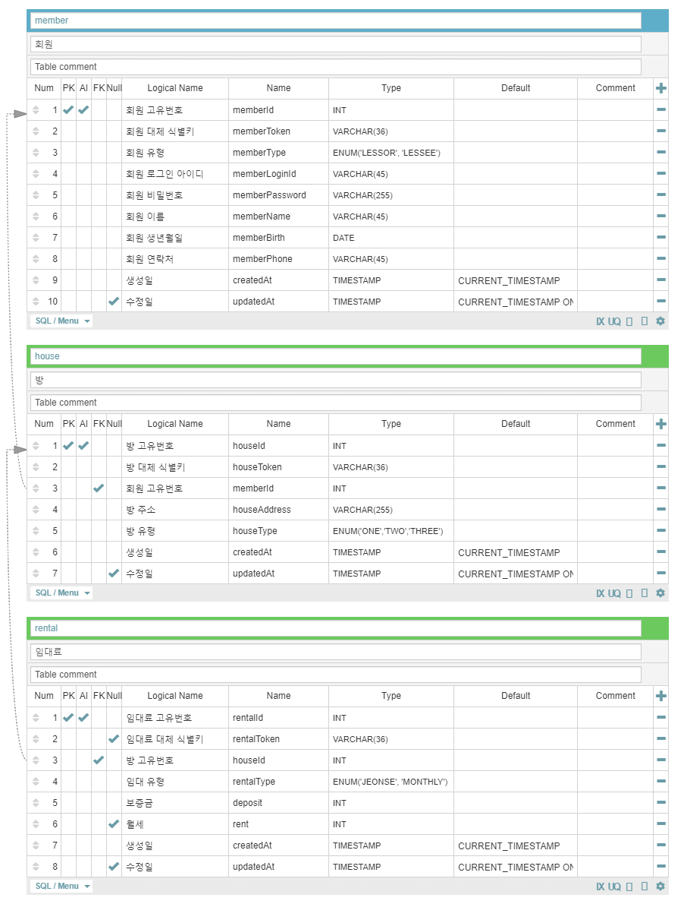
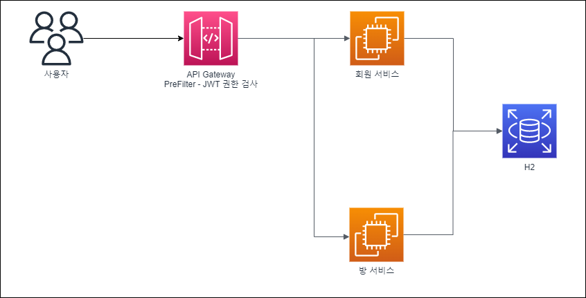

# 🏠 부동산 중개플랫폼

`스테이션3 과제`

---

# ℹ️ 실행 방법

1. API Gateway 실행
2. 회원 서비스 실행
3. 방 서비스 실행

## API Test
http-test

## [API 문서](http://localhost:8080/docs/index.html)

---

# 💡 마이크로서비스 모델링

# 💠 ERD 설계

# 🏭 시스템 아키텍처

---
